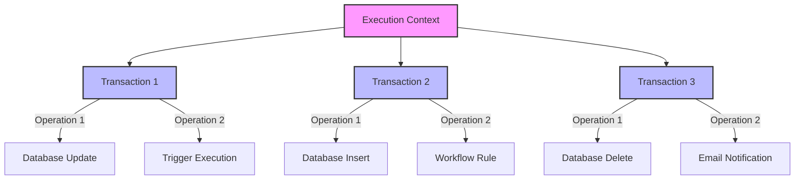

```mermaid
graph TD
    A[Execution Context] --> B[Transaction 1]
    A --> C[Transaction 2]
    A --> D[Transaction 3]

    B -->|Operation 1| E[Database Update]
    B -->|Operation 2| F[Trigger Execution]
    
    C -->|Operation 1| G[Database Insert]
    C -->|Operation 2| H[Workflow Rule]

    D -->|Operation 1| I[Database Delete]
    D -->|Operation 2| J[Email Notification]

    style A fill:#f9f,stroke:#333,stroke-width:2px;
    style B fill:#bbf,stroke:#333,stroke-width:2px;
    style C fill:#bbf,stroke:#333,stroke-width:2px;
    style D fill:#bbf,stroke:#333,stroke-width:2px;
```
