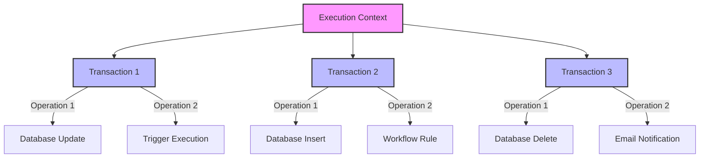

| **Limit Type**                  | **Transaction Level**                                                                                 | **Execution Context Level**                                                                 |
|---------------------------------|-------------------------------------------------------------------------------------------------------|---------------------------------------------------------------------------------------------|
| **SOQL Queries**                | Up to 100 queries per transaction. Certified managed packages have their own limits, up to 1,100 total across namespaces. | Governed by individual transaction limits; no separate context-level limit.                 |
| **DML Statements**              | Up to 150 statements per transaction. Certified managed packages have their own limits, up to 1,650 total across namespaces. | Governed by individual transaction limits; no separate context-level limit.                 |
| **CPU Time**                    | Maximum of 10,000 milliseconds per transaction.                                                        | Governed by individual transaction limits; no separate context-level limit.                 |
| **Heap Size**                   | 6 MB for synchronous and 12 MB for asynchronous transactions.                                          | Governed by individual transaction limits; no separate context-level limit.                 |
| **Callouts**                    | Maximum of 100 HTTP callouts per transaction.                                                          | Governed by individual transaction limits; no separate context-level limit.                 |
| **Total Number of Query Rows**  | Up to 50,000 rows retrieved per transaction.                                                           | Governed by individual transaction limits; no separate context-level limit.                 |
| **Maximum Execution Time**      | Governed by individual transaction limits.                                                             | Total time allowed for all transactions within an execution context to complete.            |

| **Governor Limit**                                 | **Execution Context-Level Limit**                                    | **Transaction-Level Limit**                                      |
|----------------------------------------------------|------------------------------------------------------------------------|---------------------------------------------------------------------|
| **Total Number of SOQL Queries**                   | 100 (Synchronous) / 200 (Asynchronous)                                 | 100 (Synchronous) / 200 (Asynchronous)                              |
| **Total Number of Records Retrieved by SOQL**      | 50,000                                                                 | 50,000                                                              |
| **Total Number of DML Statements**                 | 150                                                                    | 150                                                                 |
| **Total Number of Records Processed by DML**       | 10,000                                                                 | 10,000                                                              |
| **Total Number of SOSL Queries**                   | 20                                                                     | 20                                                                  |
| **Total Number of Records Retrieved by SOSL**      | N/A                                                                    | 2,000                                                               |
| **Total Number of Callouts**                       | 100                                                                    | 100                                                                 |
| **Total Cumulative Callout Time**                  | 120 seconds (Synchronous) / 300 seconds (Asynchronous)                 | 120 seconds (Synchronous) / 300 seconds (Asynchronous)              |
| **Total Heap Size**                                | 6 MB (Synchronous) / 12 MB (Asynchronous)                              | 6 MB (Synchronous) / 12 MB (Asynchronous)                           |
| **Maximum CPU Time**                               | 10,000 ms (Synchronous) / 60,000 ms (Asynchronous)                     | 10,000 ms (Synchronous) / 60,000 ms (Asynchronous)                  |
| **Maximum Transaction Execution Time**             | N/A                                                                    | 10 minutes                                                          |
| **Total Number of Queueable Jobs Added**           | 50                                                                     | 50                                                                  |
| **Total Number of Future Methods**                 | 50                                                                     | 50                                                                  |
| **Total Number of Batch Apex Jobs Queued/Active**  | 5                                                                      | 5                                                                   |
| **Total Number of `sendEmail` Method Invocations** | 10                                                                     | 10                                                                  |
| **Total Number of Single Email Messages Sent**     | N/A                                                                    | 5,000 per day per org                                               |
| **Total Number of Push Notification Invocations**  | 10                                                                     | 10                                                                  |
| **Maximum Number of Static Apex Variables**        | No specific limit (contributes to heap size)                           | No specific limit (contributes to heap size)                        |
| **Total Number of Triggers in a Transaction**      | No specific limit (controlled by overall SOQL, DML, CPU limits)        | No specific limit (controlled by overall SOQL, DML, CPU limits)     |
| **Total Number of Flow Interviews Executed**       | No specific limit (subject to CPU and other transaction limits)        | No specific limit (subject to CPU and other transaction limits)     |
| **Total Number of Process Builder Processes**      | No specific limit (subject to CPU and other transaction limits)        | No specific limit (subject to CPU and other transaction limits)     |
| **Maximum Trigger Depth**                          | No specific limit (controlled by CPU time, DML, other transaction limits) | No specific limit (controlled by CPU time, DML, other transaction limits) |
| **Total Number of Custom Metadata/Settings Queried**| No specific limit (subject to overall SOQL query limits)               | No specific limit (subject to overall SOQL query limits)            |
| **Total Number of Chained Jobs in a Transaction**  | 1 (for Batch Apex jobs)                                                | 1 (for Batch Apex jobs)                                             |

In Salesforce, governor limits are in place to ensure efficient use of shared resources and to prevent a single transaction from monopolizing the platform. Execution Context-Level Governor Limits apply across an entire Apex execution context, regardless of how many transactions or operations are performed within that context.

Here's a list of key **Execution Context-Level Governor Limits:**

**1. Total Number of SOQL Queries**
Limit: 100 (Synchronous) / 200 (Asynchronous)
Description: This is the maximum number of SOQL queries that can be issued within a single execution context.
**2. Total Number of Records Retrieved by SOQL Queries**
Limit: 50,000
Description: This limit applies to the total number of rows retrieved by SOQL queries across the entire execution context.
**3. Total Number of DML Statements**
Limit: 150
Description: The maximum number of DML operations (like insert, update, delete, or undelete) that can be executed within a single execution context.
**4. Total Number of Records Processed by DML Statements**
Limit: 10,000
Description: The total number of records that can be inserted, updated, deleted, or undeleted within a single execution context.
**5. Total Number of Callouts (HTTP Requests or Web Service Calls)**
Limit: 100
Description: The maximum number of callouts to external services that can be made within a single execution context.
**6. Total Number of Apex Callouts (HTTP Request or Web Service Calls) Time**
Limit: 120 seconds (Synchronous) / 300 seconds (Asynchronous)
Description: The total time allowed for all callouts within an execution context.
**7. Total Number of SendEmail Methods**
Limit: 10
Description: The maximum number of Messaging.sendEmail method calls allowed within a single execution context.
**8. Total Number of SOSL Queries**
Limit: 20
Description: The maximum number of SOSL queries allowed within a single execution context.
**9. Total Heap Size**
Limit: 6 MB (Synchronous) / 12 MB (Asynchronous)
Description: The maximum amount of memory allocated to store objects, variables, and state in the execution context.
**10. Total Number of Callouts**
Limit: 100
Description: The maximum number of HTTP requests or web service calls to external systems in a single execution context.
**11. Maximum CPU Time**
Limit: 10,000 milliseconds (Synchronous) / 60,000 milliseconds (Asynchronous)
Description: The total CPU time consumed by all Apex code in a single execution context.
**12. Total Number of Queueable Jobs Added**
Limit: 50
Description: The maximum number of queueable jobs that can be added within a single execution context.
**13. Maximum Execution Time for a Single Transaction**
Limit: 10 minutes
Description: The maximum time allowed for a transaction to complete within an execution context.
**14. Total Number of Future Methods**
Limit: 50
Description: The maximum number of future method invocations allowed within a single execution context.
**15. Total Number of Batch Apex Jobs Queued or Active**
Limit: 5
Description: The maximum number of batch jobs that can be queued or active simultaneously in a single execution context.
**16. Total Number of Push Notification Method Invocations**
Limit: 10
Description: The maximum number of Messaging.pushNotification method invocations in a single execution context.
**17. Total Number of Callouts (HTTP Requests or Web Services Calls) Time**
Limit: 120 seconds (Synchronous) / 300 seconds (Asynchronous)
Description: The maximum time allowed for all callouts within a single execution context.
**18. Total Number of Process Builder Processes or Flows Invoked**
Limit: No specific limit; limited by other factors such as the number of DML statements or SOQL queries.
These limits ensure that resources are not overused by any single execution context and help maintain the stability and performance of the Salesforce platform.

Transaction-Level Governor Limits in Salesforce apply to individual transactions within an Apex execution context. These limits ensure that each transaction is efficient and does not consume excessive resources, which could impact other processes or users.

Here's a list of key **Transaction-Level Governor Limits:**

**1. SOQL Query Limits**
Total Number of SOQL Queries Issued:
Limit: 100 (Synchronous) / 200 (Asynchronous)
Total Number of Records Retrieved by SOQL Queries:
Limit: 50,000
**2. DML Limits**
Total Number of DML Statements Issued:
Limit: 150
Total Number of Records Processed by DML Operations:
Limit: 10,000
3. SOSL Query Limits
Total Number of SOSL Queries Issued:
Limit: 20
Total Number of Records Retrieved by a Single SOSL Query:
Limit: 2,000
4. Callout Limits
Total Number of Callouts (HTTP Requests or Web Services Calls) Issued:
Limit: 100
Maximum Cumulative Callout Time:
Limit: 120 seconds (Synchronous) / 300 seconds (Asynchronous)
5. Heap Size Limits
Total Heap Size:
Limit: 6 MB (Synchronous) / 12 MB (Asynchronous)
6. CPU Time Limits
Maximum CPU Time:
Limit: 10,000 milliseconds (Synchronous) / 60,000 milliseconds (Asynchronous)
7. Transaction Execution Time
Maximum Transaction Execution Time:
Limit: 10 minutes
8. Queueable Job Limits
Total Number of Queueable Jobs Added:
Limit: 50
9. Future Method Limits
Total Number of Future Methods:
Limit: 50
10. Batch Apex Limits
Total Number of Batch Apex Jobs Queued or Active:
Limit: 5 (There is also a limit on the total number of jobs that can be in the queue across the entire org, which is 100 at a time)
11. Email Limits
Total Number of sendEmail Method Invocations:
Limit: 10
Total Number of Single Email Messages Sent:
Limit: 5,000 per day per org (single and mass email combined)
12. Push Notification Limits
Total Number of Push Notification Method Invocations:
Limit: 10
13. Static Apex Limits
Maximum Number of Static Apex Variables:
Limit: No specific limit, but they contribute to the heap size limit.
14. Trigger Limits
Total Number of Triggers in a Transaction:
Limit: No specific limit, but triggers contribute to the overall SOQL, DML, and CPU time limits.
15. Flow and Process Builder Limits
Total Number of Flow Interviews Executed:
Limit: No specific limit, but subject to CPU and other transaction limits.
Total Number of Process Builder Processes Executed:
Limit: No specific limit, but subject to CPU and other transaction limits.
16. Recursive Trigger Depth
Maximum Trigger Depth:
Limit: No specific limit, but recursive triggers are controlled by other limits like CPU time and DML limits.
17. Custom Metadata and Custom Setting Query Limits
Total Number of Custom Metadata and Custom Setting Records Queried:
Limit: No specific limit, but subject to overall SOQL query limits.
18. Chained Job Limits
Total Number of Chained Jobs in a Single Transaction:
Limit: 1 (for Batch Apex jobs)
These Transaction-Level Governor Limits help ensure that individual transactions are efficient and do not consume excessive resources, maintaining the overall stability and performance of the Salesforce environment.

In Salesforce, governor limits are crucial for maintaining the efficient use of resources in a multi-tenant environment. These limits are enforced at both the transaction level and the execution context level, ensuring that no single transaction or context monopolizes system resources.

- **Transaction-Level Governor Limits**
Transaction-level limits apply to individual transactions, which are isolated units of work that must complete successfully for changes to be committed. Here are some key transaction-level limits:
    - SOQL Queries: A maximum of 100 SOQL queries can be executed in a single transaction. However, if certified managed packages are involved, each package gets its own limit, allowing up to 1,100 SOQL queries cumulatively across namespaces.
    - DML Statements: Up to 150 DML statements are allowed per transaction. Similar to SOQL queries, certified managed packages have their own limits, with a cumulative total of 1,650 DML statements possible across namespaces.
    - CPU Time: The maximum CPU time allowed on Salesforce servers for a transaction is 10,000 milliseconds.
    - Heap Size: The total heap size is limited to 6 MB for synchronous and 12 MB for asynchronous transactions.
    - Callouts: A maximum of 100 HTTP callouts can be made in a transaction.

- **Execution Context-Level Governor Limits**
Execution context-level limits encompass everything that happens from the start of a request to the end, including all operations triggered by a DML event. These limits ensure that the overall environment remains stable and efficient:
    - Total Number of SOQL Queries: While each transaction is limited, the execution context can involve multiple transactions, each with its own limits.
    - Total Heap Size and CPU Time: These limits apply to the entire execution context, affecting all transactions within it. The execution context must manage resources efficiently to avoid exceeding these limits.
    - Maximum Transaction Execution Time: This is the total time allowed for all transactions within an execution context to complete.
By understanding and managing these governor limits, developers can ensure that their Salesforce applications run efficiently and reliably, avoiding errors and performance bottlenecks that could impact user experience.

https://architect.salesforce.com/1/asset/immutable/s/e6cf2ac/assets/images/Salesforce-Order-Of-Execution-Diagram.png

In Salesforce, Apex's execution context and transaction are closely related but not the same thing. Here's how they differ:

**1. Execution Context:**
Definition: The execution context in Salesforce refers to the environment in which your Apex code runs. It encompasses everything that occurs when a trigger, Visualforce page, batch job, or any other piece of Apex code executes.
    - Scope: An execution context may involve multiple transactions. For example, if a trigger fires multiple times due to bulk operations or recursive triggers, each trigger execution could represent a different transaction within the same overall execution context.
    - State: The state (such as static variables, governor limits, and heap size) is maintained throughout the entire execution context. This means that if multiple transactions are executed within a single execution context, they share the same governor limits.
**2. Transaction:**
Definition: A transaction in Salesforce is a unit of work that is either fully completed or not performed at all. It follows the ACID principles (Atomicity, Consistency, Isolation, Durability).
    - Scope: A transaction typically corresponds to a single operation or series of operations that Salesforce treats as a single, indivisible action. For example, a DML operation like an insert or update is part of a transaction.
    - State: Within a transaction, Salesforce ensures that all operations either succeed or fail together. If a transaction fails, all changes are rolled back.

Relationship:
Within an Execution Context: Multiple transactions can occur, especially in cases like recursive triggers or batch processing. Each transaction will be treated independently in terms of commit/rollback, but they share the same execution context.
    - Governor Limits: Limits such as SOQL queries, DML statements, and CPU time are shared across the entire execution context, even if multiple transactions are involved.
Example:
Single Execution Context, Multiple Transactions:
Imagine you have a trigger that runs on an update operation. If the trigger logic causes another update (like a recursive trigger), this could result in multiple transactions within the same execution context.
- Key Takeaway:
    - Execution context is the broader environment where Apex code runs, potentially encompassing multiple transactions.
    - Transaction is a specific unit of work within that context, ensuring that operations either succeed or fail as a group.

