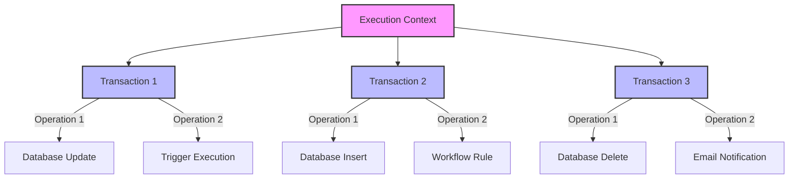

In Salesforce, governor limits are crucial for maintaining the efficient use of resources in a multi-tenant environment. These limits are enforced at both the transaction level and the execution context level, ensuring that no single transaction or context monopolizes system resources.

- **Transaction-Level Governor Limits**
Transaction-level limits apply to individual transactions, which are isolated units of work that must complete successfully for changes to be committed. Here are some key transaction-level limits:
    - SOQL Queries: A maximum of 100 SOQL queries can be executed in a single transaction. However, if certified managed packages are involved, each package gets its own limit, allowing up to 1,100 SOQL queries cumulatively across namespaces.
    - DML Statements: Up to 150 DML statements are allowed per transaction. Similar to SOQL queries, certified managed packages have their own limits, with a cumulative total of 1,650 DML statements possible across namespaces.
    - CPU Time: The maximum CPU time allowed on Salesforce servers for a transaction is 10,000 milliseconds.
    - Heap Size: The total heap size is limited to 6 MB for synchronous and 12 MB for asynchronous transactions.
    - Callouts: A maximum of 100 HTTP callouts can be made in a transaction.

- **Execution Context-Level Governor Limits**
Execution context-level limits encompass everything that happens from the start of a request to the end, including all operations triggered by a DML event. These limits ensure that the overall environment remains stable and efficient:
    - Total Number of SOQL Queries: While each transaction is limited, the execution context can involve multiple transactions, each with its own limits.
    - Total Heap Size and CPU Time: These limits apply to the entire execution context, affecting all transactions within it. The execution context must manage resources efficiently to avoid exceeding these limits.
    - Maximum Transaction Execution Time: This is the total time allowed for all transactions within an execution context to complete.
By understanding and managing these governor limits, developers can ensure that their Salesforce applications run efficiently and reliably, avoiding errors and performance bottlenecks that could impact user experience.

https://architect.salesforce.com/1/asset/immutable/s/e6cf2ac/assets/images/Salesforce-Order-Of-Execution-Diagram.png

In Salesforce, Apex's execution context and transaction are closely related but not the same thing. Here's how they differ:

**1. Execution Context:**
Definition: The execution context in Salesforce refers to the environment in which your Apex code runs. It encompasses everything that occurs when a trigger, Visualforce page, batch job, or any other piece of Apex code executes.
    - Scope: An execution context may involve multiple transactions. For example, if a trigger fires multiple times due to bulk operations or recursive triggers, each trigger execution could represent a different transaction within the same overall execution context.
    - State: The state (such as static variables, governor limits, and heap size) is maintained throughout the entire execution context. This means that if multiple transactions are executed within a single execution context, they share the same governor limits.
**2. Transaction:**
Definition: A transaction in Salesforce is a unit of work that is either fully completed or not performed at all. It follows the ACID principles (Atomicity, Consistency, Isolation, Durability).
    - Scope: A transaction typically corresponds to a single operation or series of operations that Salesforce treats as a single, indivisible action. For example, a DML operation like an insert or update is part of a transaction.
    - State: Within a transaction, Salesforce ensures that all operations either succeed or fail together. If a transaction fails, all changes are rolled back.

Relationship:
Within an Execution Context: Multiple transactions can occur, especially in cases like recursive triggers or batch processing. Each transaction will be treated independently in terms of commit/rollback, but they share the same execution context.
    - Governor Limits: Limits such as SOQL queries, DML statements, and CPU time are shared across the entire execution context, even if multiple transactions are involved.
Example:
Single Execution Context, Multiple Transactions:
Imagine you have a trigger that runs on an update operation. If the trigger logic causes another update (like a recursive trigger), this could result in multiple transactions within the same execution context.
- Key Takeaway:
    - Execution context is the broader environment where Apex code runs, potentially encompassing multiple transactions.
    - Transaction is a specific unit of work within that context, ensuring that operations either succeed or fail as a group.

